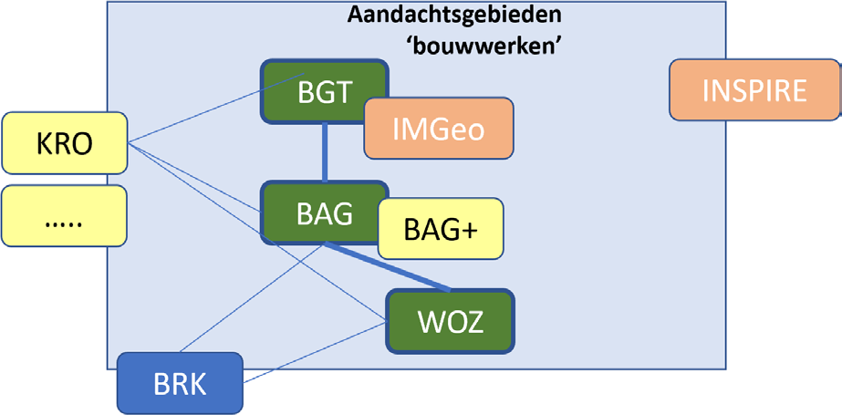
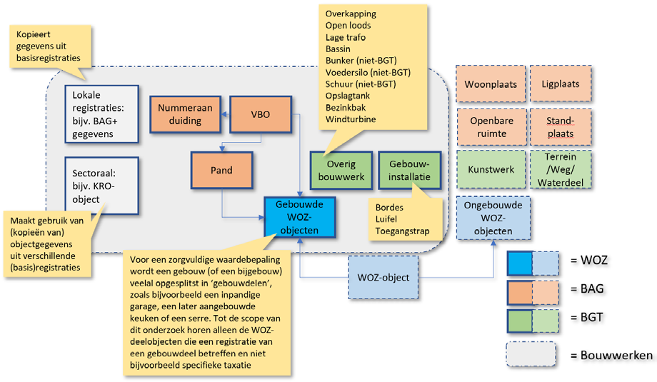
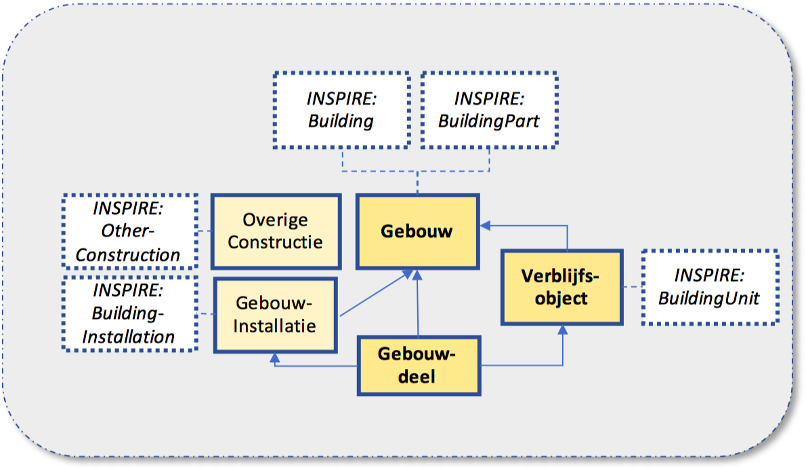

**Samenhangende objectenregistratie**

# Rapport werkgroep bouwwerken
_**Een eerste conceptuele verkenning**_

_Versie 1.0_
_21-10-2018_

{:width="25%"} {:width="25%"}

**Rapport werkgroep bouwwerken: een eerste conceptuele verkenning**

In opdracht van het ministerie van BZK en de VNG

Werkgroepleden | Organisaties |
|:---|:---|
Damir Brnobic _(voorzitter)_ | Ministerie van BZK |
Gerlof de Haan _(secretaris)_ | VNG Realisatie |
Frans Barg | Gemeente Den Haag |
Melina de Boer | Instituut Fysieke Veiligheid |
Christa van Caulil | Belastingsamenwerking West-Brabant |
Richard Dalebout | Belastingsamenwerking Gemeenten en Hoogheemraadschap Utrecht |
Hans van Eekelen | Geonovum |
Timo Erinkveld | Gemeente Rotterdam |
Alain van Hamond | Syntrophos |
Ruud Kathmann | Waarderingskamer |
Frank Kooij | Kadaster |
Erwin Marsman | Gemeente Ommen-Hardenberg |
Gert Prins | Gemeente Den Haag |
Gijs Schulkes | Gemeente Deventer |

## 1. Inleiding

### Aanleiding

De basisregistraties in het ruimtelijk domein zijn afzonderlijk van elkaar tot stand gekomen en in gebruik genomen. Vanuit de praktijk zijn in de afgelopen jaren verschillende signalen ontvangen dat er knelpunten bestaan in de inwinning, bij het beheer en het gebruik van de verschillende basisregistraties. Die hebben onder meer betrekking op inhoudelijke discrepanties tussen de verschillende basisregistraties en niet efficiënte bijhoudingsprocessen. Tegelijkertijd leiden ontwikkelingen als de komst van de Omgevingswet, verdere standaardisatie van dienstverlening en (nieuwe) maatschappelijke opgaven op het gebied van bijvoorbeeld energie en duurzaamheid tot nieuwe behoeften. Hierbij wordt steeds meer gevraagd om een completere (in de toekomst 3D) informatiepositie, gebaseerd op een ondubbelzinnige set basisgegevens, die zowel efficiënt beheerd als gebruikt kan worden.

Vanuit gemeenten is voor de doorontwikkeling van de (basis)registraties in het ruimtelijk domein in 2017 een streefbeeld voor een samenhangende objectenregistratie ontwikkeld. Zowel bestuurlijk als vanuit de gemeentelijke werkpraktijk bestaat er breed draagvlak voor de verdere uitwerking van dit streefbeeld. Tegelijkertijd zet ook het ministerie van BZK stappen in de verdere samenhangende doorontwikkeling van de geo-informatie-infrastructuur in Nederland. Een samenhangende doorontwikkeling van de basisregistraties in het ruimtelijk domein maakt daarvan onderdeel uit. BZK en gemeenten willen de activiteiten rondom de doorontwikkeling van een aantal (basis)registraties zoveel mogelijk bundelen en werken op dit moment gezamenlijk aan de verdere uitwerking van een hiertoe in de komende jaren te doorlopen traject. Daarbij is ook de Waarderingskamer betrokken. Als eerste concrete stap in dit traject is een tweetal werkgroepen opgestart die voor de onderwerpen 'bouwwerken' en 'wegen' gaan werken aan een verdere verdieping van de bestaande knelpunten en behoeften op deze onderwerpen.

> **Wat is een samenhangende objectenregistratie?**
>
> Een samenhangende objectenregistratie is één centraal georganiseerde uniforme registratie met daarin basisgegevens over objecten in de fysieke werkelijkheid. Daaronder verstaan we objecten die in het terrein zichtbaar zijn, zoals gebouwen, wegen, water, spoorlijnen en bomen, aangevuld met enkele objecten als woonplaatsen en openbare ruimten. Voor deze objectenregistratie komt een landelijke voorziening, waarin bronhouders direct mutaties kunnen doorvoeren. Gebruikers kunnen gegevens direct uit de objectenregistratie opvragen met behulp van moderne bevragingstechnieken. In de registratie wordt de volledige levensloop van objecten bijgehouden (van de eerste schets tot het verdwijnen ervan). De kleinste relevante eenheden (legoblokjes) worden geregistreerd. Deze worden functioneel tot grotere eenheden geaggregeerd voor gebruikers op basis van logica.
>
> Bron: [Informatieblad samenhangende objectenregistratie](http://https://www.geobasisregistraties.nl/documenten/brochure/2018/07/31/informatieblad_objectenregistratie) (31-7-2018)

### Opdracht

De werkgroep Bouwwerken heeft de volgende opdracht meegekregen (zie bijlage I voor de volledige opdrachtformulering):

_Voer een verdiepende analyse uit op de knelpunten die er in de huidige situatie bestaan ten aanzien van de samenhangende vastlegging en het gebruik van gegevens over bouwwerken in BAG, BGT en WOZ-registratie (met een nadrukkelijke focus op gebouwen) en schets op conceptueel niveau de contouren van de objecten en gegevens die er over bouwwerken zouden moeten worden opgenomen in een geïntegreerde objectenregistratie._

Tijdens de verkenning is de in de opdracht benoemde omgeving verder uitgebreid en als volgt in beeld gebracht:

_Figuur 1: aandachtsgebieden 'bouwwerken'_

- IMGeo: Informatiemodel Geografie
- BAG+: Niet-authentieke gegevens, die door gemeenten als 'plusgegevens' worden bijgehouden in de BAG
- KRO: Kernregistratie Objecten (t.b.v. het Veiligheidsdomein)
- INSPIRE: Europese richtlijn voor de realisatie van een infrastructuur voor de uitwisseling van ruimtelijke informatie binnen de EU

Deze rapportage beschrijft de eerste resultaten van de uitgevoerde verkenning. Over het document vindt in deze fase geen besluitvorming plaats. Eerst worden bepaalde vraagstukken in een volgende stap nog verder inhoudelijk uitgediept. Ook hebben resultaten van andere werkgroepen mogelijk nog enige invloed op de in deze rapportage en de inhoudelijke verdiepingen beschreven oplossingsrichtingen. Op een later moment worden de verschillende deelrapportages daarom verder op elkaar worden afgestemd en waar mogelijk in elkaar geschoven. Dit zal in de eerste helft van 2019 leiden tot een eerste complete conceptuele schets van de objectenregistratie, waarover dan besluitvorming plaats vindt. Pas daarna wordt gewerkt aan de feitelijke modellering van de conceptuele schets. Deze rapportage moet op dit moment dan ook vooral worden gezien als de basis voor het met elkaar voeren van het gesprek over geschetste mogelijke oplossingsrichtingen en de verdere uitwerking daarvan.

### Scope

Voor het definiëren van de scope Bouwwerken is aansluiting gezocht bij het Klasse `<<featuretype>> GEBOUW` in de [NEN 3610:2011](http://https://www.geonovum.nl/geo-standaarden/nen-3610-basismodel-voor-informatiemodellen):

_Vrijstaande overdekte en geheel of gedeeltelijke met wanden omsloten toegankelijke ruimte die direct of indirect met de grond is verbonden._

Bovenstaande definitie sluit bouwwerken uit die niet overdekt zijn, maar verder wel aan alle criteria van de definitie van een GEBOUW voldoen. Dergelijke bouwwerken, die binnen het huidige IMGeo gedefinieerd zijn als OVERIG BOUWWERK, vallen wel binnen de scope van deze verkenning.

### Beleidsthema's

In de verkenning zijn onderstaande beleidsthema's genoemd als gebruikers van gebouwinformatie.

_Bestaande thema's:_
- Vergunningverlening (Omgevingswet);
- Handhaving en Toezicht;
- Veiligheid en Openbare Orde;
- WOZ en Belastingheffing;
- Huisvesting/Woningvoorraad;
- Objectgebonden subsidies.

_'Nieuwe' thema's:_
- Energietransitie: _energieneutraal maken gebouwen, gas/riolering, WTW, zonnecollectoren/panelen e.d.;_
- Veranderende marktvraag woningen: _specifieke woonvormen voor ouderen (langer thuis wonen), huisvesting specifieke doelgroepen (studenten, arbeidsmigranten, asielzoekers, toeristen/Airbnb);_
- Veranderende marktvraag niet-woningen: _leegstandsproblematiek, transformatie vastgoedgebruik;_
- Bouwkundige problematiek met landelijke aanpak: _asbest, ondeugdelijke constructies (balkons e.d.), betonrot, paalfundering, verzakking door verdroging en/of bodemdaling;_
- Veiligheid: _APK voor woningen, inspecties installaties;_
- Klimaatadaptatie: _water op straat, hittebestendige stad;_
- Cyclische economie: _nieuwe (bouw‑)productiemethoden;_
- Digitale stad/SmartCity: _sensordata._

Het gebruik van gegevens over bouwwerken is daarmee heel divers en dat blijkt ook uit de tijdens de verkenning opgehaalde brede informatiebehoefte.

### Aanpak en werkwijze

De werkgroep is gestart met een inventarisatie van behoeften en knelpunten onder bronhouders en gebruikers van de huidige BAG, WOZ en BGT. De werkgroepleden hebben hun achterban uitgevraagd, terwijl alle gemeentelijke bronhouders in het voorjaar van 2018 input konden leveren tijdens de regionale bijeenkomsten van het Gemeentelijke Geo-Beraad (GGB). De resultaten zijn opgenomen in een Excelbestand dat als bijlage II is toegevoegd. Hieraan zijn ook de resultaten toegevoegd van soortgelijke inventarisaties uit voorgaande jaren.

Vervolgens heeft de werkgroep op verschillende niveaus een ordening aangebracht in de opgehaalde behoeften en knelpunten:

- Behoefte/knelpunt heeft te maken met beheer of gebruik, wat is de reden, wie is de behoeftesteller;
- Behoefte/knelpunt raakt huidige informatiemodellen, processen, techniek en/of organisatie;
- Behoefte/knelpunt heeft betrekking op bestaande BAG‑, WOZ‑, en/of BGT-inhoud, nieuwe inhoud of op overige zaken (terugmeldvoorziening, kwaliteitsregime, etc.).

Deze ordeningen zijn in bijlage II opgenomen als extra kolommen bij de behoeften en knelpunten. Daardoor kan met behulp van de filtermogelijkheden van Excel, afhankelijk van het gewenste soort inzicht, eenvoudig geclusterd worden binnen de totale inventarisatie. Met één druk op de knop is er

de beschikking over een overzicht van alle impactvolle inbreng, welke knelpunten een specifieke behoeftesteller ervaart, wat voor wensen bronhouders zelf hebben, etc. Vervolgens zijn de behoeften en knelpunten door de werkgroep verdeeld in een top zes van belangrijkste issues die op dit onderwerp spelen. Deze onderwerpen hebben voorrang gekregen tijdens de werkgroepsessies en zijn gebruikt als basis voor een houtskoolschets voor de toekomst. Dit heeft geresulteerd in een lijst met principes, toe te passen bij de samenstelling van de objectenregistratie, en een aantal inhoudelijke punten die verwerkt moeten worden in de objectenregistratie.

### Leeswijzer

Na de inleiding worden als eerste in hoofdstuk 2 de issues rondom gebouwen beschreven die in een samenhangende objectenregistratie moeten worden opgelost. De issues zijn door de werkgroep opgehaald met de inventarisatie van knelpunten en behoeften. Deze inventarisatie is opgenomen in bijlage II.

In hoofdstuk 3 wordt een eerste ontwerp op hoofdlijnen uitgewerkt voor de objectenregistratie. Op dit fundament kunnen de objecten en attributen verder uitgewerkt worden door de vervolgwerkgroep, zonder dat hier al onomkeerbare keuzes worden gemaakt.

Hoofdstuk 4 beschrijft de manier waarop het ontwerp uitgewerkt kan worden richting de objectenregistratie, bezien vanuit de huidige BAG, WOZ en BGT. Hier worden al enkele issues met oplossingsrichtingen benoemd die zeker opgelost dienen te worden.

Naast de inhoud bestaat er ook een drietal succesfactoren die cruciaal zijn voor een basisregistratie: inwinning, gebruik en kwaliteit. Ook bronhouders en afnemers onderschrijven dit, gezien de input die zij geleverd hebben in de vorm van behoeften en knelpunten (bijlage II). Deze onderwerpen zijn opgenomen in hoofdstuk 5.

Het rapport wordt afgesloten met een hoofdstuk met conclusies en aanbevelingen richting de kerngroep.

## 2. Issues huidig gegevenslandschap

Bij het thema 'bouwwerken' constateren we dat we met een groep elementaire gegevensverzamelingen te maken hebben die zich verder uitstrekt dan de wettelijke basisregistraties.

Centraal hebben we te maken met de basisregistraties die wettelijk verankerd zijn en een landsdekkende vulling hebben. Het gaat in dit kader vooral om de gegevens over bouwwerken in de BAG, BGT en WOZ. De WOZ kent als basisregistratie geen gebouwinformatie. De WOZ kent wel een onderbouwing van waarde op basis van o.a. de objectkenmerken van gebouwde objecten. Deze gegevens worden lokaal vastgelegd conform het sectormodel WOZ als 'WOZ-object' en 'WOZ‑ deelobject', beide met een set attributen.

Er zijn daarnaast specifieke sectoren waar bouwwerkinformatie wordt vastgelegd, gebruikmakend van de informatie uit verschillende (basis‑)registraties. Zo wordt door het Instituut Fysieke Veiligheid (IFV) voor het veiligheidsdomein een Kernregistratie Objecten bijgehouden. Daarnaast worden op provinciaal niveau risicokaarten beheerd. Ook lokaal wordt nog gebouwinformatie vastgelegd, bijvoorbeeld in de vorm van BAG+ als niet-authentieke aanvulling op de BAG-gegevens bij gemeenten.

_Figuur 2: huidig 'bouwwerk'-gegevenslandschap als scope voor de conceptuele verkenning_

Alle gegevensverzamelingen binnen het grijze kader uit figuur 2 zijn in scope van de conceptuele verkenning. Een verkenning die is gestart met het in kaart brengen van alle behoeften en knelpunten die bij bronhouders en afnemers rondom het 'bouwwerk' leven. In dit hoofdstuk duiden we deze inventarisatie door deze terug te brengen naar een zestal hoofdonderwerpen:

- Het 3D-model;
- Kleinste eenheid van registratie;
- Informatiebehoefte, objecten en kenmerken in de objectenregistratie;
- Kwaliteit;
- Inwinning;
- Discrepanties in wet‑ en regelgeving.

Per onderwerp is beschreven welke issues er spelen en welke vraagstukken uitgewerkt moeten worden tijdens het vervolgtraject op dit verkennende rapport.

### Het 3D-model

#### Wat speelt er

Op dit moment zijn gebouwgegevens in de geo-basisregistraties in 2D gemodelleerd. De BGT schrijft wel een onderscheid voor in niveaus als attribuut bij onder andere een Wegdeel (bijvoorbeeld bij tunnels en viaducten), waarmee objecten ten opzichte van elkaar in de ruimte worden gepositioneerd (ook wel aangeduid als 2,5D). Van een ruimtelijk 3D-model van 'het object' is echter nog geen sprake. Het bijhouden van geo-informatie in 3D is nu geen wettelijke verplichting. Initiatieven zijn er lokaal, maar niet gestandaardiseerd en landsdekkend. Verschillende wijzen van inwinnen bij de bron (of achteraf genereren) worden verkend. De toegankelijkheid van de binnen het Bouw‑ en civiele domein opgebouwde informatie uit zogenaamde BIM-modellen wordt daarbij onderzocht. Aan de gebruikerskant is de behoefte aan geo-informatie in 3D sterk groeiende. Voor nieuwe ontwikkelingen (zoals de Omgevingswet) is een landelijk, gestandaardiseerd 3D-model van de werkelijkheid een randvoorwaarde.

Overigens blijft voor sommige toepassingen geo-informatie in 2D nog steeds voldoende of soms juist noodzakelijk. Hetzelfde kan gezegd worden voor de behoefte aan flexibiliteit in de 2D-presentatie. In de huidige situatie is dit opgelost door verschillende presentaties van hetzelfde bouwwerk (pand) toe te staan in de BAG en de BGT (bovenaanzicht vs. maaiveld). Volgens het Gegevenswoordenboek WOZ kunnen ook het WOZ-object en WOZ-deelobject (2D) geometrie hebben (nog niet verplicht). Een samenhangende objectenregistratie zal ook in de toekomst in deze behoefte moeten kunnen voorzien. Om deze reden is dit als uitgangspunt opgenomen in hoofdstuk 3.3.3 onder 2.

#### Belangrijkste vraagstukken

- Hoe te komen tot een minimale, landelijke standaard voor het vastleggen van het 3D-model van Bouwwerken in een samenhangende objectenregistratie en wat zit daar dan in?
- Welke (inter)nationale standaarden zijn van invloed op een landelijke standaard (bijv. INSPIRE)?
- Hoe kan een 3D-model van Bouwwerken bijdragen aan het verbeteren van samenhang tussen de verschillende objectdefinities binnen de BGT, BAG en WOZ?
- Op welke wijze kan een 3D-model het (geautomatiseerd) afleiden van verschillende oppervlaktegegevens en de blijvende behoefte aan 2D-geometrie ondersteunen?
- In welke mate kan en moet in een landelijk 3D-model naast informatie over de buitenkant (het 3D-object in relatie tot zijn omgeving) ook informatie over de binnenkant (de indeling binnen het gebouw) worden vastgelegd?
- Hoe kan worden voorzien in de inwinning, bijhouding en kwaliteitszorg voor 3D van gebouwen?

### Kleinste eenheid van registratie

#### Wat speelt er

Op dit moment is de kleinste eenheid van registratie voor gebouwgegevens in de landelijke basisregistraties het verblijfsobject (VBO) uit de BAG. De BGT sluit op Pandniveau aan op de BAG en voegt daar OverigBouwwerk aan toe voor gebouwde objecten die (nog) niet binnen de BAG zijn afgebakend als Pand, die wat betreft kleinste eenheid van registratie vergelijkbaar zijn met Pand in de BAG. In de Basisregistratie WOZ kennen we alleen het WOZ-object als 'virtueel object' met een relatie naar een VBO in de BAG.

Het VBO heeft een belangrijke functie waar het gaat om afbakening van eenduidig gebruik gekoppeld aan 'adressering', gericht op vindbaarheid en gebruik in administratieve processen. Het Pand heeft een dergelijke functie voor processen in het fysieke domein. Voor een aantal gebruikersprocessen sluit het huidige detailniveau in de landelijke basisregistraties echter niet goed aan op de specifieke informatiebehoefte. Dit speelt bijvoorbeeld bij bouwjaar (wanneer als gevolg van verbouw en renovatie verschillende bouwjaren en renovatiejaren in een pand voorkomen), bij gebruiksdoel (wanneer de verschillende activiteiten binnen een VBO wel degelijk van invloed zijn op aspecten als o.a. Bouwbesluit, vergunningverlening, veiligheid en waardering) en bij oppervlakte (wanneer de oppervlakten van delen van een VBO verschillend worden beoordeeld in een vervolgproces en bovendien sprake is van verschillende oppervlaktebegrippen zoals BVO, VVO en GO).

In de praktijk zien we dat gegevens uit de basisregistraties op het niveau van verblijfsobject en pand aanvullend in een gebruikersproces moeten worden 'opgeknipt' of dat het hogere detailniveau op lokaal niveau in de bijhouding apart van de basisregistraties wordt georganiseerd. Op die wijze wordt bijvoorbeeld een WOZ-object conform het Sectormodel WOZ verder onderverdeeld in gebouwde en ongebouwde WOZ-deelobjecten, waarbij dan bijvoorbeeld twee of drie WOZ-deelobjecten gekoppeld zijn aan één verblijfsobject en daarmee gezamenlijk de objectkenmerken van dit verblijfsobject vastleggen. Deze gedetailleerde gebouwgegevens worden lokaal verzameld en geregistreerd.

Het gevolg is vergelijkbaar: op het oog dezelfde kenmerken worden meerdere keren ingewonnen en geregistreerd (centraal en lokaal). De noodzakelijke afstemming die hiervan het gevolg is, maakt het beheer en gebruik van gegevens over bouwwerken onnodig ingewikkeld en versnipperd.

Dit probleem kan zich herhalen bij een eventuele uitbreiding van de bestaande inhoud van een nieuwe objectenregistratie. Voor de registratie van 'nieuwe' kenmerken als aanwezigheid asbest, kamergewijze verhuur, veiligheidsvoorzieningen of energiezuinige maatregelen zullen Pand en/of VBO vaker niet dan wel de meest voor de hand liggende objecten van registratie zijn.

#### Belangrijkste vraagstukken

- Is er een benadering van de kleinste eenheid van registratie in de samenhangende objectenregistratie die leidt tot een eenduidige relatie tussen de huidige BAG-panden en VBO's en gebruik van deze gebouwgegevens in gebruikersprocessen?
- In welke mate komt de 'nieuwe' kleinste eenheid van registratie tegemoet aan het probleem van inefficiënte bijhouding?
- In hoeverre leidt dit tot aanpassing van afbakeningsdefinities binnen de betrokken basisregistraties?
- En vanuit de invalshoek van de gebruiker: zijn er aanpassingen in de werkwijze mogelijk die een optimale afstemming tussen objectenregistratie en informatiebehoefte vereenvoudigen?

### Informatiebehoefte, objecten en kenmerken in objectenregistratie

#### Wat speelt er

In het verlengde van de problematiek van de kleinste eenheid van registratie speelt er met betrekking tot gegevens over bouwwerken in een samenhangende objectenregistratie een tweetal vraagstukken. Het eerste vraagstuk betreft de afbakening van de verzameling objecten die vallen onder het begrip 'bouwwerken'. Nu zien we deze 'kandidaatobjecten' terug als Panden (met of zonder VBO) in de BAG en BGT en als OverigeBouwwerken en Gebouwinstallaties in de BGT. Met name in de gemeentelijke praktijk bestaat de behoefte om aan bepaalde gebouwde objecten waarin géén VBO is afgebakend toch een (niet-formeel) adres toe te kennen. Het Referentiemodel Stelsel Gemeentelijke Basisgegevens (RSGB) definieert deze specifieke categorie objecten als Overige Gebouwd Object. Samen met het VBO en het Pand uit de BAG vormen deze objecten de verzameling van alle gebouwde objecten in de gemeente. (er zijn meer overige gebouwde objecten, maar sommige zouden geadresseerd kunnen worden bijv. luifel van onbemand brandstofverkooppunt).

Het tweede vraagstuk betreft de afbakening op gegevensniveau (m.a.w. welke informatie over een bouwwerk wordt opgenomen in de samenhangende objectenregistratie). Daarbij is onderscheid te maken in knelpunten en wensen m.b.t. bestaande inhoud, d.w.z. attributen die nu (verplicht) deel uit maken van de BAG, BGT en WOZ, én wensen m.b.t. nieuwe inhoud (soms opgehaald als knelpunt t.a.v. de bestaande inhoud).

Bij de eerste categorie (bestaande inhoud) betreft het met name aspecten als bruikbaarheid en uniformiteit: bouwjaar (oorspronkelijk vs. renovatiejaar), objecttypering (te globaal en/of niet gestandaardiseerd), gebruiksdoel (vergund bouwkundig gebruik vs. Feitelijk gebruik) en oppervlakte (diverse oppervlaktebegrippen, uniformiteit conform meetinstructies).

Bij de tweede categorie (nieuwe inhoud) is het beeld meer divers. Soms betreft het een uitbreiding van de huidige basisregistraties met bestaande gegevens uit lokale of sectorale registraties met als doel een breder gebruik van deze gegevens (veiligheidsdomein en handhaving en toezicht). In andere gevallen betreft het bijvoorbeeld een uitbreiding met nieuwe gegevens waarover een landelijke registratiebehoefte nodig is of wordt geacht (asbestproblematiek, toeristische kamerverhuur en energietransitie).

#### Belangrijkste vraagstukken

- Welke objecten vallen onder het begrip 'bouwwerken' en welke niet?
- Welke basisinhoud over Bouwwerken moet in ieder geval landen in een landelijke samenhangende objectenregistratie?
- Wat zijn de criteria voor het uitbreiden van de bestaande gegevens uit BAG, WOZ en BGT met nieuwe kenmerken?
- Hoe zorgen we er voor dat gebouwgegevens uit de landelijke samenhangende objectenregistratie op een eenduidige wijze en in samenhang met gebouwgegevens uit lokale of sectorale bronnen kunnen worden gebruikt?
- Hoe zorgen we ervoor dat de objectenregistratie dermate volledig is dat de aangepaste definities, die binnen het huidige RSGB zijn opgenomen (v.w.b. gebouwde objecten), overbodig worden?

### Kwaliteit

#### Wat speelt er

De actualiteit van de geometrie van gebouwen is een bekend knelpunt en komt ook hier terug. Voor bijvoorbeeld het Veiligheidsdomein (specifiek brandweer) is een actueel beeld van de feitelijk gebouwde situatie buiten van groot belang. Tussen gereed gemelde bouw en definitief ingemeten geometrie zit conform wettelijke regels maximaal 6 maanden. Dat is in geval van calamiteiten onvoldoende. Bronhouders constateren op hun beurt dat het vaak onmogelijk is om deze termijn in de praktijk te halen.

Het ontbreken van (relevante) meta-informatie is een ander knelpunt. Dat spitst zich in het bijzonder toe op informatie over de wijze waarop gebouwgegevens zijn verzameld en bepaald. Het domein WOZ zou gebruik willen maken van oppervlaktegegevens uit de BAG voor de waardebepaling. De definitie, detaillering en kwaliteit, en daarmee de bruikbaarheid van dit gegeven, wordt sterk beïnvloed door de gehanteerde meetinstructie en de wijze van inwinnen. De informatie over wanneer, hoe en op basis van welke instructie de oppervlakte is gemeten, is nu niet beschikbaar vanuit de BAG.

In beide voorbeelden is er overigens een sterke relatie met het onderwerp Inwinning (zie hierna). Meer in het algemeen is er voor zowel bronhouders als afnemers behoefte aan harmonisatie van kwaliteitsnormen en -toezicht m.b.t. gebouwgegevens over de basisregistraties heen.

#### Belangrijkste vraagstukken

- Welke minimale kwaliteitsnormen hanteren we voor gebouwgegevens in een samenhangende objectenregistratie?
- Hoe kunnen we toezicht in samenhang organiseren?
- Op welke onderdelen kan meta-informatie een bijdrage leveren aan de bruikbaarheid van gebouwgegevens?
- Op welke wijze kunnen we tegemoet komen aan de wensen t.a.v. een hogere actualiteit van geometrische gegevens?

### Inwinning

#### Wat speelt er

Als gevolg van ontwikkelingen als 'de terugtrekkende overheid' zullen wijzigingen in de gebouwde situatie steeds minder vaak via het formele vergunningenproces tot stand komen. Tegelijkertijd neemt de vraag naar meer detail en actualiteit van gebouwgegevens eerder toe dan af (zie ook boven). De behoefte aan informatie met een hoog detail‑ en actualiteitsniveau staat op gespannen voet met de inspanning die aan bronhouderskant moet worden geleverd. Dit spanningsveld biedt kansen voor nieuwe strategieën voor inwinning. Innovatieve inwinningstechnieken op basis van digitaal beeldmateriaal en laserscanning zijn steeds vaker een goedkoper alternatief voor traditionele inwinningsmethoden. En veel wordt verwacht van een fundamenteel andere benadering van het inwinningsproces, waarbij juist de belanghebbende (burgers en bedrijven) een 'bronhoudersrol' krijgt bij het actueel houden van gebouwgegevens.

#### Belangrijkste vraagstukken

- In hoeverre kan een samenhangende objectenregistratie een bijdrage leveren aan het terugdringen van de bijhoudingsinspanning door bronhouders?
- Welke nieuwe inwinningsmethoden zijn geschikt om met voldoende kwaliteit gebouwgegevens in te winnen?
- In hoeverre is de inwinning landelijk te organiseren (of op basis van generieke processen)?
- Op welke wijze kunnen we de belanghebbende (burgers en bedrijven) betrekken bij de bijhouding van gebouwgegevens?

### Discrepanties in wet‑ en regelgeving

#### Wat speelt er

BAG, WOZ en BGT hanteren verschillende begrippen en definities m.b.t. de afbakening van bouwwerken. Daarnaast zien we in gerelateerde wetgeving en verordeningen die betrekking hebben op het gebruik van gebouwde omgeving (denk aan de Woningwet, kamerverhuur, Toeslagenwet, huurbeleid en belastingverordeningen) aanvullende bepalingen en objectdefinities die vaak (deels) of geheel afwijken van de afbakening uit de basisregistraties.

#### Belangrijkste vraagstukken

- In hoeverre kan de ontwikkeling van een samenhangende objectenregistratie bijdragen aan het verkleinen van de 'wildgroei' in afbakeningsdefinities van de gebouwde omgeving?
- In welke mate kan in gerelateerde wetgeving worden 'voorgesorteerd' op begrippen en definities in een samenhangende objectenregistratie?

## 3. Houtskoolschets nieuw 'bouwwerk'

Deze houtskoolschets beschrijft onderdelen van de samenhangende objectenregistratie vanuit het perspectief van bouwwerken. Het is een eerste globale oriëntatie op basis van wat er is opgehaald uit het werkveld en is bedoeld om richting te geven aan een mogelijk ontwerp-vervolg.

Het 'bouwwerk' is één van de bouwstenen van de samenhangende objectenregistratie. Deze objectenregistratie maakt op zijn beurt ik zou dit niet blijven benadrukken als je BAG, WOZ en BGT wil brengen onderdeel uit van de bredere doorontwikkeling in samenhang van de geo-gerelateerde basisregistraties. Deze geo-basisregistraties zijn vervolgens weer onderdeel van het stelsel van basisregistraties. Dit stelsel, de bijbehorende voorzieningen en standaarden vormen tot slot samen de [cluster Gegevens](http://https://www.digitaleoverheid.nl/voorzieningen/gegevens) binnen de Generieke Digitale Infrastructuur (GDI).

Het 'bouwwerk' is daarmee een fundamenteel onderdeel van de overheidsbrede gegevenshuishouding. Betrouwbare en actuele informatie over bouwwerken is voor heel veel verschillende overheidstaken van cruciaal belang. Daarnaast speelt deze informatie een grote rol in private dienstverleningsprocessen. Dat blijkt ook wel uit het feit dat adres‑ en gebouwgegevens uit de huidige BAG jaarlijks [1,6 miljard](http://https://www.geobasisregistraties.nl/documenten/publicatie/2018/08/6/infographic-bag-afnemersonderzoek-2018) keer van de landelijke voorziening worden afgenomen. Het indirecte gebruik (via derden zoals TomTom) ligt nog veel hoger. Vanwege het grote belang van het 'bouwwerk' is er een duidelijke toekomstvisie nodig rondom de landelijke kwaliteit en beschikbaarheid van informatie over dit object. Naar deze visie kan vervolgens het informatiemodel 'bouwwerk' ontworpen worden.

### Toewerken naar toekomstvisie

In de toekomst zou 'eenmalige inwinning, **meervoudig** gebruik' moeten zijn uitgegroeid tot 'eenmalige inwinning, **alle** gebruik'. Dit betekent onder andere dat een objectenregistratie alle informatie zou moeten bevatten die nodig is om elke informatiebehoefte van de overheid ten aanzien van gebouwen te kunnen bedienen. Gebruikers kunnen er dan op vertrouwen dat nieuwe gegevens tijdig beschikbaar komen, waardoor zelf inwinnen helemaal niet nodig is. Het beantwoorden van een nieuwe informatiebehoefte komt daarmee niet langer neer op het inwinnen van nieuwe gegevens, maar op het ontwikkelen van een nieuw algoritme dat de gegevens die de objectenregistratie al beschikbaar heeft, op de gewenste manier gebruikt en interpreteert. Elk gegeven zou dan zichtbaar moeten maken wie dat gegeven hoe en wanneer heeft ingewonnen of bewerkt. Hieruit volgt logischerwijs dat ieder gegeven in de objectenregistratie wordt ingewonnen op het voor dat gegeven meest relevante laagste niveau. Dit maakt het mogelijk dat het gegeven geaggregeerd kan worden naar nieuwe objecten c.q. informatie.

'**Alle** gebruik' houdt tevens in dat de objectenregistratie als basismodel moet dienen voor het volgens bovenstaande principes inwinnen en relateren van aanvullende objectgegevens. De overheid hoeft daardoor niet meer alle gegevens zelf in te winnen. Andere bronhouders (ook particulieren en bedrijven) hebben vrije toegang tot alle gegevens (voor zover er geen persoonsgegevens in het geding zijn) en kunnen deze zelf aanvullen en verbeteren. Het principe van 'eenmalige inwinning' moet in deze toekomstvisie dus ook niet worden uitgelegd als één vaste bronhouder per object of gegeven. Wel zal per (voorkomen van een) object duidelijk moeten zijn wie verantwoordelijkheid is voor de registratie, omdat er bijvoorbeeld bezwaar‑ of beroepsprocedures ingesteld kunnen worden.

Een voorbeeld van aggregatie is de recente opgave vanuit het kabinet aan BZK om de Woningwet aan te passen en een registratie op te zetten voor objecten/woningen die feitelijk gebruikt worden voor toeristische verhuur. In deze informatiebehoefte zou eenvoudig voorzien kunnen worden door verblijfsobjecten met als feitelijk gebruik logiesfunctie en vergund/toegestaan gebruik woonfunctie via een algoritme te labelen. Nieuwe informatie over gebouwen ontstaat dan uit bestaande gegevens.

Als het gaat om aanvullend bronhouderschap kan gedacht worden aan veiligheidsregio's die de locatie van de voordeur toevoegen aan bouwwerken. Een ander voorbeeld is een huiseigenaar die het 3D-model van zijn of haar woning zelf kan aanvullen of aanpassen.

Een dergelijke visie maakt dat het nodig is om verder te kijken dan alleen het harmoniseren van een aantal basisregistraties. Het stel basisregistraties moet gaan functioneren als daadwerkelijk stelsel en ook op het niveau van wet‑ en regelgeving zal gekeken moeten worden of harmonisatie mogelijk dan wel noodzakelijk is. Naast de eerder genoemde Woningwet is ook het Digitaal Stelsel Omgevingswet (DSO) een goed voorbeeld. Daar ontwikkelt men een eigen bouwwerkendefinitie en worden regels rondom vergunningsvrij bouwen verder versoepeld. Deze ontwikkelingen zijn (mogelijk) van invloed op de manier waarop binnen de objectenregistratie de objectdefinities tot stand komen en straks gegevens worden ingewonnen. Merk hierbij op dat de Wabo het sinds 2014 mogelijk maakt om zonder omgevingsvergunning het gebruik van een object te wijzigen, waardoor het gebruiksdoel (vergunde gebruik) in de BAG plotseling in een ander daglicht kwam te staan (en betekenis verloor). Het is dus van belang dat dit soort sporen onderling met elkaar afgestemd worden.

### Verkenning basisontwerp

Dit rapport formuleert in hoofdstuk 3.1 een richting voor de visie rondom 'bouwwerken'. Omdat deze nog niet is uitgewerkt, aangezien dat buiten de scope van deze conceptuele verkenning ligt, en er nog geen lijntjes gelegd zijn met andere wetgevingstrajecten die (mogelijk) van invloed zijn op de samenhangende objectenregistratie, zal het eerste ontwerp van het bouwwerk zeer globaal van aard zijn. Ook zullen objectdefinities en bijbehorende attributen nog niet worden uitgewerkt.

In dit hoofdstuk wordt geprobeerd om, aan de hand van INSPIRE als randvoorwaarde, te komen tot een eerste basisontwerp dat nog geen onomkeerbare keuzes maakt, maar wel maximaal aansluit op de successen van het gebruik van BAG‑ en BGT-gegevens op dit moment.

#### INSPIRE als randvoorwaarde

In de Infrastructure for Spatial Information in Europe ([INSPIRE](http://inspire.ec.europa.eu/id/document/tg/bu))-richtlijn zijn regels vastgesteld voor de oprichting van een infrastructuur voor ruimtelijke informatie in de Europese Unie. INSPIRE zorgt ervoor dat informatie en kennis uit verschillende sectoren kunnen worden gecombineerd en verspreid. INSPIRE is daarmee geen informatiemodel, maar een uitwisselingsformaat. Dit houdt in dat er veel vrijheid is om het bouwwerk te ontwerpen, maar zodra objecten of gegevens lijken op de INSPIRE-tegenhanger, zal er conform die Europese specificatie uitgewisseld moeten kunnen worden.

Zo onderscheidt INSPIRE bijvoorbeeld de hoogte van een bouwlaag als attribuut en vereist dat attributen homogeen worden vastgelegd. Stel dat de objectenregistratie de verdiepingshoogte zou willen vastleggen, dan is het verticaal splitsen van woningen met een uitbouw in twee zogenaamde BuildingParts verplicht (zie figuur 4 op pagina 16 voor een voorbeeld hiervan). In beginsel volgt de structuur en inhoud van de beoogde samenhangende objectenregistratie dus niet verplicht de objectdefinities van INSPIRE, en neemt het niet verplicht alle attributen over van INSPIRE, maar wanneer deze samenhangende objectenregistratie te dicht tegen het Europese uitwisselingsformaat aan schuurt, verplicht INSPIRE wel om bepaalde gegevens te kunnen uitwisselen en dus vast te leggen.

#### Robuust en eenvoudig objectenmodel

##### Overwegingen

De werkgroep streeft verder naar een eenvoudig, maar robuust ontwerp, dat voldoende flexibiliteit in zich heeft om voorbereid te zijn op de toekomstige vraagstukken. Het toekomstige model zal in ieder geval een oplossing moeten bieden voor de behoefte aan een (kleinere) eenheid van registratie voor de meer bouwkundige kenmerken van bouwwerken. Deze behoefte leidt in de huidige situatie immers tot inefficiënte (dubbele) inwinning en het 'opknippen' van bestaande (BAG‑)objecten in kleinere eenheden in de sectorale en lokale registraties waarin gegevens over bouwwerken worden bijgehouden. Daarnaast is de beoogde samenhangende objectenregistratie met de introductie van deze kleinere eenheid van registratie beter voorbereid op het logisch relateren van nieuwe, aanvullende kenmerken over bouwwerken in het kader van nieuwe beleidsvraagstukken. Het principe van eenmalig inwinnen voor alle gebruik wordt hiermee ingevuld.

Deze nieuwe eenheid wordt voorlopig aangeduid als 'Gebouwdeel'. Dit Gebouwdeel komt niet in de plaats van het huidige VBO. Laatstgenoemd object heeft zich bewezen als bruikbare basis voor het onderscheiden van adresseerbare objecten en is qua definitie vrijwel gelijk aan de BuildingUnit uit INSPIRE. De werkgroep is van mening dat de relatie tussen het Gebouwdeel en het huidige VBO eenduidig moet zijn. Het Gebouwdeel valt in de visie van de werkgroep daarom altijd in zijn geheel binnen de afbakening van een VBO én een VBO kan meerdere gehele Gebouwdelen bevatten.

Verder denkt de werkgroep het objectenmodel te kunnen vereenvoudigen door verschillende typen bouwwerken onder dezelfde objectdefinitie te laten vallen. Dat komt in de praktijk neer op uitbreiding (verruiming) van de definitie van het huidige Pand, zodat veel van de bouwwerken die nu als OverigBouwwerk (BGT) en/of OverigGebouwdObject (RSGB) zijn geclassificeerd hier ook onder gaan vallen. Om het verschil met het Pand in de huidige situatie te benadrukken, introduceert de werkgroep hiervoor in het ontwerp het begrip Gebouw, analoog aan het binnen INSPIRE gedefinieerde Building.

Bouwwerken die niet aan de ruimere definitie van een Gebouw voldoen, worden in het ontwerp aangeduid met OverigeConstructie (analoog aan de OtherConstruction uit INSPIRE). Ook op dit punt is de werkgroep van mening dat de relatie tussen Gebouwdeel en Gebouw eenduidig moet zijn. Het Gebouwdeel valt in de visie van de werkgroep daarom altijd in zijn geheel binnen de afbakening van een Gebouw én een Gebouw kan meerdere gehele Gebouwdelen bevatten.

Dit leidt uiteindelijk tot het volgende model met de relatie naar INSPIRE:

_Figuur 3: houtskoolschets 'bouwwerken'_

##### Beschrijving objecten (niet zijnde definities)

In dit model zijn de volgende objecten opgenomen, die we als volgt omschrijven en waarbij de daadwerkelijk definities nog uitgewerkt moeten worden:

- **Gebouw**: overdekte en geheel of gedeeltelijke met wanden omsloten toegankelijke ruimte (of bouwkundige constructie) die direct of indirect met de grond is verbonden. Er is nog niet besloten in hoeverre een gebouw ondeelbaar moet zijn en dus bij de totstandkoming niet opgedeeld mag kunnen worden in kleinere eenheden die elk afzonderlijk aan de definitie van een gebouw voldoen.
- **Verblijfsobject:** de kleinste binnen een of meer gebouwen gelegen en voor woon‑, bedrijfsmatige of recreatieve doeleinden geschikte eenheid van gebruik die ontsloten wordt via een eigen afsluitbare toegang vanaf de openbare weg, een erf of een gedeelde verkeersruimte, onderwerp kan zijn van goederenrechtelijke rechtshandelingen en in functioneel opzicht zelfstandig is.
- **Gebouwdeel**: een op basis van nog nader uit te werken criteria kleinst mogelijk af te bakenen bouwkundige ruimte met als hoofdcriterium dat een gebouwdeel altijd in zijn geheel binnen het bijbehorende verblijfsobject (indien van toepassing) en gebouw (en eventueel BuildingPart) dient te liggen.
- **OverigeConstructie**: zelfstandig bouwwerk dat niet voldoet aan de gebouwdefinitie. Het uitwerken van deze definitie valt buiten de scope van het vervolgtraject op dit rapport.
- **GebouwInstallatie**: een component aan de buitenzijde van een gebouw, die het aanzicht van het gebouw mede bepaalt. In het vervolgtraject wordt onderzocht of deze component op kan gaan in de gebouw‑ en/of gebouwdeeldefinitie.

De werkgroep is van mening dat het toekomstige geo-model voor bouwwerken de inwinning en verwerking van geo-informatie in 3D vanaf de bron moet ondersteunen. Op basis van de vastgelegde 3D-geo-informatie moet een gebruiker in staat zijn om ieder object uit het ontwerp in 3D af te bakenen en te presenteren. Daarnaast biedt het geomodel ondersteuning aan het eenvoudig (lees: geautomatiseerd) afleiden van de gewenste 2D-geo-informatie. Om dit mogelijk te maken stelt de werkgroep voor om 3D-geo-informatie in te winnen op het niveau van de kleinste eenheid van registratie: het Gebouwdeel.

De volgende voorbeelden tonen de objectrelaties inclusief 3D-geometrie zoals deze aan de hand van de houtskoolschets uit figuur 3 uitgewerkt zouden kunnen worden:

Objecttype | Bouwstenen |
|:---|:---|
Gebouwdeel | A, B, C |
Verblijfsobject | A+B |
Gebouw | A+B, C |

_Figuur 4: eengezinswoning met uitbouw en losstaande schuur_

Objecttype | Bouwstenen |
|:---|:---|
Gebouwdeel | A, B, C, D |
Verblijfsobject | A+C ,B |
Gebouw | A+B+C, D |

_Figuur 5: bovenwoning, benedenwoning met uitbouw en losstaande schuur_

In dit basisontwerp laat de werkgroep zich nog niet uit over het apart afbakenen van bouwlagen. Dat heeft vooralsnog te maken met de BuildingPart uit INSPIRE die een gebouw niet horizontaal, maar verticaal splitst. Wel houden we deze mogelijkheid open voor de verdere uitwerking, onder meer omdat in het uitgewerkte voorstel voor IMGeo 3.0 een voorstel is opgenomen om aparte geometrie te registreren voor 'overbouw' en 'onderbouw'.

##### Level of detail

Met dit voorgestelde model doet de werkgroep nog geen uitspraak over het gewenste detailniveau van het 3D-model. Het detailniveau van een 3D-model wordt volgens een internationale standaard aangeduid met Level of Detail (LoD). De werkgroep stelt voor om in de samenhangende objectenregistratie toe te groeien naar een verplicht, minimaal LoD als landelijke basisinhoud en daarnaast als niet-verplichte informatie een hoger LoD (of het hoogste) te ondersteunen.

### Principes

#### Algemeen

##### Consensus binnen de werkgroep

1. De integrale objectenregistratie is een objectgerichte registratie.
2. Er wordt onderscheid gemaakt in enerzijds verplichte en niet-verplichte gegevens en anderzijds optionele en niet-optionele gegevens. De niet-verplichte gegevens zijn te herkennen aan het metagegeven `Mogelijk geen waarde`. Verplichte gegevens moeten altijd worden ingevuld en zo nodig actief worden ingewonnen. Niet-verplichte gegevens moeten ook worden ingevuld, maar alleen als de bronhouder ze al heeft. Er is geen inwinningsplicht bij niet-verplichte gegevens. Optionele gegevens kunnen in de werkelijkheid bestaan of niet bestaan. Of een gegeven optioneel is, blijkt uit een nul bij de kardinaliteit van dat gegeven, bijvoorbeeld `[0..1]`. Zo heeft niet elk gebouw een kelder. Als de kelder een verplicht gegeven is, moet de bronhouder actief gaan kijken of een gebouw wel of geen kelders heeft. Als de kelder niet verplicht is, vult de bronhouder de kelder alleen in als hij al weet of dat gebouw een kelder heeft. Als hij dat niet weet, hoeft hij niets in te winnen en vult hij alleen in dat hij geen waarde heeft en een code voor de reden waarom. Het informatiemodel moet erin voorzien dat dat kan bij alle gegevens waarvoor een inwinningsverplichting niet aan de orde is.
3. Bronhouderschap voor nieuwe partijen is mogelijk voor niet-verplichte, objectgerichte inhoud (geen nieuwe objecttypen, wel nieuwe attributen van bestaande objecttypen). Denk hierbij bijvoorbeeld aan voordeuren die door veiligheidsregio's gestandaardiseerd kunnen worden toegevoegd aan verblijfsobjecten en panden
4. Elk object beschikt over een eigen identificatienummer, waarbij een groeipad uitgewerkt wordt voor huidige BAG‑, WOZ‑ en BGT‑ID's naar ID's binnen de nieuwe objectenregistratie die niet leidt tot een knip in de huidige levensloop van objecten.
5. Elk object beschikt over een eigen levenscyclus.

##### Discussiepunt

1. De integrale objectenregistratie is een toepassingsvrije registratie.

#### 3D

##### Consensus binnen de werkgroep:

1. 3D-geometrie is een verplicht te registreren attribuut met het metagegeven `Mogelijk geen waarde`. Een bronhouder die (nog) niet beschikt over 3D-geometrieën, hoeft dus alleen in te vullen dat hij geen waarde heeft. Op termijn wordt 3D-geometrie een verplicht te registreren attribuut met een waarde die voldoet aan de kwaliteitseisen. Hiervoor wordt nog een groeipad ontwikkeld.
2. Alle objecten die in de nieuwe objectenregistratie te maken hebben met bouwwerken (Gebouw, Verblijfsobject en Gebouwdeel) beschikken over 3D-geometrie.
    - Toelichting I: met de komst van 3D zal 2D niet meer apart ingewonnen hoeven te worden; 2D kan worden afgeleid van 3D.
    - Toelichting II: 3D-geometrie wordt ingewonnen op het niveau van de kleinste eenheid van registratie, het Gebouwdeel. Door aggregatie is de 3D-geometrie van 'bovenliggende' objecten af te leiden.

##### Discussiepunt:

1. Het Gebouwdeel en Verblijfsobject kunnen bestaan uit meerdere bouwlagen en binnen de werkgroep is verkend om de Bouwlaag als apart 3D-object binnen het Pand te onderscheiden. Hierover bestaat vooralsnog geen consensus.

#### Kwaliteit

##### Juistheid

1. Bij elke vaststelling of mutatie van een object is een vorm van onderbouwing nodig:
    - Uitgewerkt wordt of meta-gegevens volstaan of dat voor de vaststelling van objecten iets zwaardere eisen zouden moeten gelden (bijv. link naar besluit);
2. De nog uit te werken kwaliteitseisen voor de verschillende attributen:
    - Bijvoorbeeld: elk jaar wordt 20% van de attribuutwaarden gecontroleerd;
3. De nog uit te werken metagegevens voor de verschillende attributen;
4. De nog uit te werken omgang met onjuistheden.

##### Compleetheid

1. Verplichte attributen worden altijd opgenomen;
2. Voor niet-verplichte attributen geldt geen inwinningsplicht;
3. De nog uit te werken gegevenscatalogus beschrijft de domeinwaarden waarbinnen de verschillende attribuutwaarden moeten passen.

##### Volledigheid

1. Alle objecten die voldoen aan de definitie van één van de objecttypen, moeten worden geregistreerd;
2. Objecten die op grond van een brondocument bekend zijn bij de gemeente, worden opgenomen op basis van dat brondocument;
3. Objecten die in de werkelijkheid bestaan maar waarvan geen regulier brondocument beschikbaar is, worden opgenomen op basis van een verklaring;
4. Objecten worden historisch gemaakt in de registratie als deze ophouden te bestaan in de werkelijkheid.

##### Actualiteit

1. Inschrijving van gegevens binnen een bepaald aantal werkdagen na de brondocumentdatum;
2. Verplichte jaarlijkse mutatiedetectie;
3. De nog uit te werken actualiteitseisen voor de verschillende attributen.

## 4. Transitie

### Van huidige inhoud naar nieuwe objectenregistratie

Het idee is om de gegevens uit de huidige BAG, WOZ en BGT, aangevuld met de belangrijkste behoeften en knelpunten die in het kader van deze werkgroep zijn geïnventariseerd, op te hangen aan het conceptuele ontwerp uit hoofdstuk 3 als kapstok. Dit rapport beperkt zich hier alleen tot het benoemen van discussiepunten en oplossingsrichtingen. De daadwerkelijke uitwerking hiervan, en de manier waarop deze landt in de houtskoolschets, wordt opgepakt door de vervolgwerkgroep op dit rapport.

De volgende onderwerpen op object‑ en attribuutniveau worden in ieder geval nader bestudeerd, omdat ze betrekking hebben op bestaande inhoud uit de huidige BAG, WOZ en BGT. Daarmee is de kans aanzienlijk dat ze, in welke vorm dan ook, terugkeren in de nieuwe objectenregistratie:

Object/attribuut | Nader uit te werken |
|:---|:---|
Gebouw | • Welke typen gebouwen willen we onderscheiden (schuur, bunker, etc.), gelet op het 'gebruik' dat vanuit de huidige BAG en WOZ mogelijk overgeheveld wordt naar het Verblijfsobject en/of Gebouwdeel? • Welke deel van de OverigBouwwerk-populatie landt in de nieuwe Gebouwdefinitie? • Wellicht kan een deel van de attributen geregistreerd worden op niveau van Gebouwdeel, zodat gegevens op Gebouwniveau afgeleid kunnen worden i.p.v. dubbel geregistreerd (bijv.: het Gebouwdeel met het oudste bouwjaar = oorspronkelijk bouwjaar Gebouw). |
Verblijfsobject | Wellicht kan een deel van de attributen geregistreerd worden op niveau van Gebouwdeel, zodat gegevens op Verblijfsobjectniveau afgeleid kunnen worden i.p.v. dubbel geregistreerd. |
Gebouwdeel | Het Gebouwdeel moet gestandaardiseerd worden, i.t.t. de deelobjecten zoals de WOZ die nu kent (meerdere codelijsten in omloop). Daarbij hoort ook een uitwerking van welke typen gebouwdeel zullen worden afgebakend en de aansluiting bij meetinstructies NEN 2580 e.d. |
Geometrie, Lengte | INSPIRE kent richtlijnen met betrekking tot het vastleggen van 2D‑ en 3D-geometrie en de hoogte. Nader uitwerking verdient het gewenste verplichte en optionele detailniveau van 3D-geometrie van het bouwwerk in de objectenregistratie. |
Status | Hoe ziet de nieuwe levenscylcus van objecten eruit, gelet op de huidige BAG-statussen en WOZ-percentages gereed? |
Geconstateerd | Voorstel: objecten kunnen geconstateerd worden, attributen worden gesignaleerd. |
Documentdatum, Documentnummer | Voorstel: voor alle objecttypen opnemen, maar kan ook bestaan uit andersoortige metadata die aangeven wanneer en hoe bepaalde gegevens zijn ingewonnen. |
Bouwjaar | Voorstel: het Bouwjaar registreren op Gebouwdeelniveau, waarbij het oudste bouwjaar geldt als oorspronkelijk bouwjaar voor het Gebouw. |
Gebruiksdoel, Gebruikscode, Bestemming, Soortobject-code | Werk vergund, feitelijk en toegestaan gebruik uit. |
Inhoud, Oppervlakte | • Voorstel Oppervlakte: zet de nieuwe internationale richtlijn (IPMS) af tegen de aankomende NEN 2580-update en huidige Meetinstructie gebruiksoppervlakte woningen en bepaal zowel nieuwe (soorten) Oppervlakte(n) als groeipad er naartoe. • Voorstel Inhoud: niet-verplicht (en uit 3D-buitenkant af te leiden) |

Een volledig overzicht van alle in de uitwerking mee te nemen behoeften en knelpunten kan worden gegenereerd door in het Excelbestand (bijlage II) onder de tabbladen 'Behoeften' en 'Knelpunten' in de kolom 'Advies werkgroep' te filteren op de termen 'Meenemen' en 'Overwegen'. Hierin zijn ook suggesties voor nieuwe inhoud meegenomen.

### Internationale ontwikkelingen oppervlaktebepaling

Bij het uitwerken van de objectdefinities en attributen dienen bestaande en in ontwikkeling zijnde internationale standaarden en richtlijnen in acht te worden genomen. De meest in het oog springende ontwikkeling, op attribuutniveau, is die op het gebied van de oppervlaktebepaling.

De International Property Measurement Standards Coalition ([IPMSC](http://https://ipmsc.org)) ontwikkelt diverse internationale standaarden op het gebied van het inmeten van vastgoed. Met de IPMS for Residential Buildings en IPMS for Office Buildings zijn er al richtlijnen voor woningen en kantoorgebouwen. Volgens ingewijden binnen de werkgroep betreffen dit echter nog geen vastgestelde standaarden. Om deze reden zal verder onderzocht worden of er aansluiting wordt gezocht bij de nieuwe versie van NEN 2580, waarvan de ontwikkeling binnen afzienbare tijd start, of dat deze stap moeten worden overgeslagen ten faveure van IPMS.

Belangrijk is dat de gebruikte definitie aansluit bij de behoeften in Nederland en internationale ontwikkelingen. Voor woningen speelt daarom zeker ook de Meetinstructie gebruiksoppervlakte woningen op basis van NEN2580 een belangrijke rol doordat deze in de Nederlandse situatie nu door nagenoeg alle partijen wordt omarmt.

### Eerste impactverkenning

#### BAG

De samenhangende objectenregistratie heeft op objectniveau gevolgen voor het Pand, omdat nog meer soorten bouwwerken onder de nieuwe definitie zullen vallen, en nauwelijks impact op het Verblijfsobject. Op het niveau van attributen zal er een uitbreiding van de gegevensset plaatsvinden, waarbij voor een deel geput zal kunnen worden uit de huidige WOZ en BGT.

#### WOZ

- Bij afbakening van het WOZ-object speelt eigendom en gebruik een rol. Dit werkt naast fysieke kenmerken ook door in de afbakening van WOZ-deelobjecten. Hoe werkt dat als de afbakening door de objectregistratie voorgeschreven wordt?
- Vanuit permanente marktanalyse (PMA) of beoordeling van bezwaarschriften worden ook objectcontroles uitgevoerd voor alle onderdelen. Worden dit in de nieuwe situatie terugmeldingen of krijgt men rechten om mutaties door te voeren in de objectenregistratie? Hoe werkt dit proces in combinatie met wettelijke termijnen van bezwaar en beroep?
- Op het gebied van toezicht zal de ENSIA-systematiek en die van de Waarderingskamer geharmoniseerd moeten worden.
- Het beeld bestaat dat de verschillen tussen de huidige nauwkeurigheidseisen van BAG en WOZ te verwaarlozen zijn en daarmee eenvoudig in elkaar te schuiven zijn.

#### BGT

De introductie van het Gebouwdeel heeft voor IMBGT|IMGeo forse impact wanneer van bestaande gebouwen ook de geometrie van deze gebouwdelen een verplicht attribuut wordt. Wanneer dat het geval is, moet een vervolgonderzoek aantonen welk volume er overblijft aan inwinning van geometrie van complexe situaties, na het zoveel mogelijk geautomatiseerd opnemen van bijvoorbeeld de geometrie van de eenvoudiger en veel voorkomende gestapelde verblijfsobjecten binnen flatgebouwen. Mogelijk dat dan de inzet van de nieuwste technologie zoals laserscanning een oplossing daarvoor kan bieden.

Het vervolgonderzoek moet ook uitsluitsel geven of bruikbare informatie voor deze gebouwdeelgeometrie is vastgelegd in (bouw)tekeningen die zijn geregistreerd in de BAG/WOZ. In het geval van nieuwbouw moet een met de geostandaarden afgestemde toepassing van BIM‑ standaarden (bouwwerkinformatiemodel) de input leveren voor de gebouwdeelgeometrie.

## 5. Algemene oplossingsrichtingen objectenregistratie

### Inwinning

#### Alternatieve inwinningsmethoden

Op dit moment worden diverse knelpunten ervaren en toekomstige uitdagingen gezien door bronhouders als het gaat om de bijhouding van de huidige basisregistraties. Omdat een eenvoudige en betaalbare inwinning aan de bronhouderkant ook voor de nieuwe objectenregistratie een belangrijke succesfactor is, staan we hier kort stil bij alternatieve inwinningsmethoden. In de linkerkolom de behoeften en knelpunten zoals ze zijn ingebracht door bronhouders en in de rechterkolom de reactie van onze werkgroep in de vorm van een oplossingsrichting:

Behoefte/knelpunt | Oplossingsrichting |
|:---|:---|
• Er wordt steeds meer vergunningsvrij ge‑ en verbouwd, zowel intern als aan de buitenkant • Vanuit VTH-taken worden steeds minder vaak mutaties aangeleverd aangaande de levensloop van objecten • Mutatiesignalering leidt tot hoge beheerlast | • MijnOverheid en MijnOverheid voor Ondernemers benutten als kanalen voor burgers en ondernemers om onjuiste gegevens te (laten) herstellen (onderdeel NL DIGIbeter) • Meldingsplicht (vergoeding of sanctie) voor vergunningsvrij bouwen lijkt haaks te staan op principe binnen het DSO om aanvragers eenmaal vooraf "lastig te vallen met vragen" • Ook zonder plicht zijn veel eigenaren/ betrokkenen bereid gegevens te verstrekken (bijvoorbeeld BIM model van een verbouwing) wanneer dit eenvoudig is en er ook iets tegenover staat (inpassing in omgeving, eenvoudige toegang tot bouwvoorschriften). • Inzet van nieuwe technieken onderzoeken: satelliet, infrarood, [3D-scan bovengronds en grondradarscan ondergronds](http://civitas-advies.nl/project/gemeente-huizen), [BIM-modellen](http://https://www.youtube.com/watch?v=lNIcHrMcu6U) en centraal via LV's beschikbaar stellen van comfortdata |
3D op een hoog detailniveau is niet voor heel Nederland interessant | Kadaster kan via één van de LV's, op basis van landelijke luchtfoto's en AHN-bestanden, een eenvoudig 3D-model als eerste tijdelijke landsdekkende vulling van een 3D model aanleveren. Dit model kan vervolgens door de betreffende bronhouder in beheer worden genomen en optioneel worden opgewerkt tot een hoger detailniveau. |
• Het inmeten en vastleggen van objectkenmerken vindt nu plaats op veel verschillende plekken/processen: daar zit er veel overlap in. Kan gecentraliseerd worden voor grotere efficiëntie • Integrale inwinning complex a.g.v. verschillende basisregistraties | • Let op: sommige gegevens kunnen centraal ingewonnen worden, zie de bovengenoemde oplossingsrichting voor 3D, maar voor de meeste gegevens geldt dat niet. • Net als de BGT kan de objectenregistratie 'verschillende' bronhouders hebben. |

#### Bronhouderschap

In de huidige BGT is het zo dat bronhouders elkaars gegevens kunnen muteren, inclusief terugdraaimogelijkheid. Dit laatste zal nogmaals onderzocht moeten worden in het kader van de objectenregistratie. Er zullen namelijk objecten en gegevens in opgenomen worden die kunnen leiden tot bezwaar‑ en beroepsprocedures. De juridische verantwoordelijkheid, voor het betreffende object of de mutatie, zou daarom altijd herleidbaar moeten zijn tot één bronhouder.

Voor nu laten we graag de mogelijkheid open voor een efficiënte inwinning door niet te pleiten voor een vaste bronhouder per object of attribuut. Het kan namelijk wenselijk zijn om bijvoorbeeld ProRail naast hun spoor ook de gebouwen op het eigen terrein in te laten winnen, of burgers hun eigen woninggegevens via MijnOverheid te laten verbeteren (signaleren). Dit moet verder uitgewerkt worden, ook in juridische zin. Wellicht is het een optie om de verantwoordelijkheid te beleggen op voorkomenniveau, waarbij de meta-gegevens informatie bevatten over o.a. wie er gemuteerd heeft.

Tot slot is het een verkenning waard of _objecten_, waarvan het wellicht wenselijk is dat er één vaste bronhouder eindverantwoordelijk voor is (bijvoorbeeld het Verblijfsobject), verrijkt kunnen worden met niet-verplichte _attributen_ door andere bronhouders. Op die manier kunnen alle gegevens, waarvoor een landelijke informatiebehoefte bestaat, bijgehouden worden op één plek zonder dat de inwinningslast opgestapeld wordt bij dezelfde bronhouder(s).

### Kwaliteit

Naast een eenvoudige en betaalbare inwinning vormt ook de gegevenskwaliteit een belangrijke voorwaarde voor succes. In hoofdstuk 3.3 is al een aantal kwaliteitsprincipes opgenomen. Daarnaast zijn hieronder in de linkerkolom de behoeften en knelpunten, die betrekking hebben op de kwaliteit, opgenomen zoals ze zijn ingebracht door bronhouders en in de rechterkolom de reactie van onze werkgroep in de vorm van een oplossingsrichting:

Behoefte/knelpunt | Oplossingsrichting |
|:---|:---|
Terugmelden op basisregistraties is omslachtig | Beschikbaar stellen van functionaliteit waardoor gebruikers binnen hun eigen omgeving/applicatie via een aparte knop kunnen terugmelden |
• Te weinig capaciteit bij gemeenten om massa-terugmeldingen te verwerken • Het kwaliteitsregime van de verschillende basisregistraties met elkaar in lijn brengen | • Gezamenlijke kwaliteitsprincipes formuleren • Toewerken naar gezamenlijk toezicht |
Eén loket voor terugmeldingen | Er kunnen best verschillende kanalen zijn om terug te melden, zolang ze aan de achterkant maar bij de juiste bronhouder terecht komen. Aan de achterkant kan er wel sprake zijn wel één voorziening. |
Het kwaliteitsregime van de verschillende basisregistraties met elkaar in lijn brengen | • Gezamenlijke kwaliteitsprincipes formuleren, zie hoofdstuk 4.1 • Toewerken naar gezamenlijk toezicht |

### Gebruik

De derde pijler van een succesvolle basisregistratie, naast een eenvoudige/betaalbare inwinning en hoge gegevenskwaliteit, is een zo breed mogelijk gebruik door afnemers. Hiervoor gelden de volgende uitgangspunten:

1. Gegevens moeten eenvoudig te raadplegen zijn via een online viewer;
2. Via services moet eenvoudig realtime op mutaties aangesloten kunnen worden door derden;
3. De betekenis van gegevens moet duidelijk zijn voor een juist gebruik door afnemers.

## 6. Vervolgtraject

### Werkgroep 'bouwwerken'

Voor het vervolgtraject kunnen er drie aparte expertgroepjes worden geformeerd die, rekening houdend met de vraagstukken uit hoofdstuk 2, het ontwerp uit hoofdstuk 3 en de oplossingsrichtingen uit hoofdstuk 4, de volgende zaken uitwerken:

1. Uitwerken Gebouwdeel als kleinste bouwsteen;
2. 3D-model inclusief LoD, INSPIRE en IMGeo 3.0;
3. Uitwerken:
    a. Attributen;
    b. Gebouw‑ en Verblijfsobjectdefinitie.

Gezien de onderlinge samenhang van de onderwerpen ligt het voor de hand dat er qua leden overlap bestaat tussen de aparte expertgroepjes en dat de trekkers‑ en secretarisrol door dezelfde personen wordt ingevuld. Op die manier lopen de sporen niet uit elkaar.

Ook lijkt het verstandig om het 3D-model parallel aan bovenstaand spoor in breder verband te onderzoeken, bijvoorbeeld in relatie met Wegen. Op deze manier sluiten principes en objecten beter op elkaar aan. Een mogelijkheid is om tussentijds over de vervolgwerkgroepen heen centraal afstemming te zoeken.

### Algemene onderwerpen

Het ligt niet voor de hand dat de onderwerpen inwinning, kwaliteit en gebruik, zoals deze zijn uitgewerkt in hoofdstuk 5 (niet zijnde principes of uitgangspunten), terugkomen in de inhoudelijke verdieping van het 'bouwwerk'. Dit hoofdstuk presenteert vooral oplossingsrichtingen op het niveau van de objectenregistratie zelf. Om deze reden is het advies deze oplossingsrichtingen mee te nemen in het 'algemene uitgangspunten‑ en randvoorwaardendocument' van de kerngroep.

## Bijlage I: opdrachtformulering kerngroep

### Inleiding

De basisregistraties in het ruimtelijk domein zijn afzonderlijk van elkaar tot stand gekomen en in gebruik genomen. Vanuit de praktijk zijn in de afgelopen jaren verschillende signalen ontvangen dat er knelpunten bestaan in de inwinning, bij het beheer en het gebruik van de verschillende basisregistraties. Die hebben onder meer betrekking op inhoudelijke discrepanties tussen de verschillende basisregistraties en niet efficiënte bijhoudingsprocessen. Tegelijkertijd leiden ontwikkelingen als de komst van de Omgevingswet, verdere standaardisatie van dienstverlening en (nieuwe) maatschappelijk opgaven op het gebied van bijvoorbeeld energie en duurzaamheid tot nieuwe behoeften. Hierbij wordt steeds meer gevraagd om een completere (in de toekomst 3D) informatiepositie, gebaseerd op een ondubbelzinnige set basisgegevens, die zowel efficiënt beheerd als gebruikt kan worden.

Vanuit gemeenten is voor de doorontwikkeling van de (basis)registraties in het ruimtelijk domein in 2017 een streefbeeld voor een geïntegreerde objectenregistratie ontwikkeld. Zowel bestuurlijk als vanuit de gemeentelijke werkpraktijk bestaat er breed draagvlak voor de verdere uitwerking van dit streefbeeld. Tegelijkertijd zet ook het ministerie van BZK stappen in de verdere samenhangende doorontwikkeling van de geo-informatie infrastructuur in Nederland. Een samenhangende doorontwikkeling van de basisregistraties in het ruimtelijk domein maakt daarvan onderdeel uit. BZK en gemeenten willen de activiteiten rondom de doorontwikkeling van een aantal (basis)registraties zoveel mogelijk bundelen en werken op dit moment gezamenlijk aan de verdere uitwerking van een hiertoe in de komende jaren te doorlopen traject. Daarbij is ook de Waarderingskamer betrokken. Als eerste concrete stap in dit traject worden een tweetal werkgroepen opgestart die voor de onderwerpen "bouwwerken" en "wegen" gaan werken aan een verdere verdieping van de bestaande knelpunten en behoeften op deze onderwerpen.

### Opdrachtformulering

Voer een verdiepende analyse uit op de knelpunten die er in de huidige situatie bestaan ten aanzien van de samenhangende vastlegging en het gebruik van gegevens over bouwwerken in BAG, BGT en WOZ-registratie (met een nadrukkelijke focus op gebouwen) en schets op conceptueel niveau de contouren van de objecten en gegevens die er over bouwwerken zouden moeten worden opgenomen in een geïntegreerde objectenregistratie.

### Op te leveren resultaten

1. Een document waarin op systematische wijze is vastgelegd welke **knelpunten** er op dit moment bestaan in de samenhang tussen BAG, BGT en WOZ ten aanzien van objecten en gegevens over bouwwerken (met een focus op gebouwen), waarbij in ieder geval aandacht wordt geschonken aan de volgende elementen:
    - een concrete beschrijving van de aard en de omvang van de knelpunten;
    - een concrete benoeming van de processen waarin deze knelpunten zich voordoen (dat kunnen zowel bijhoudings‑ als gebruiksprocessen zijn) en daarmee wie de behoeftesteller is ten aanzien van het betreffende knelpunt;
    - een ordening van deze knelpunten naar knelpunten die voortkomen vanuit informatiemodellen (objecten en gegevens), processen, techniek en organisatie.
2. Een document waarin op systematische wijze is vastgelegd welke **behoeften** er voor BAG, BGT en WOZ bestaan ten aanzien van objecten en gegevens over bouwwerken (met een focus op gebouwen), waarbij in ieder geval aandacht wordt geschonken aan de volgende elementen:
    - een samenhangende beschrijving van alle uit eerdere trajecten bekende behoeften en de mate waarin op dit moment reeds in een oplossing is voorzien (bijvoorbeeld via BAG 2.0);
    - een beschrijving van aanvullende eisen en wensen die vanuit zowel bijhoudings‑ als gebruiksprocessen worden gesteld, de reden waarom deze behoefte bestaat en wie de behoeftesteller is ten aanzien van de betreffende eis of wens;
    - een ordening van deze behoeften naar behoeften die te maken hebben met informatiemodellen (objecten en gegevens), processen, techniek en organisatie.
3. Een document waarin op **conceptueel niveau** (dat wil zeggen in voor mensen begrijpelijke benoeming van objecten en de gegevens die daarover worden vastgelegd) wordt beschreven wat de objecten en gegevens zijn die er over bouwwerken zouden moeten worden opgenomen in een geïntegreerde objectenregistratie, waarbij in ieder geval aandacht wordt geschonken aan de volgende elementen:
    - een beschrijving van de verschillende objecten, de daarover bij te houden gegevens en de relaties die er tussen deze objecten bestaan;
    - een beschrijving van de wijze waarop ontwikkelingen als 3D en BIM een plaats hebben binnen deze conceptuele beschrijving;
    - een eerste indicatie van de overeenkomsten en verschillen die er bestaan ten opzichte van bestaande informatiemodellen (zoals IMGEO, IMBAG, IMWOZ en RSGB);
    - een overzicht van de vraagpunten waarvoor als volgende stap antwoorden zullen moeten worden gevonden of keuzen moeten worden gemaakt;
    - een voorstel van de wijze waarop een verdere vervolguitwerking zou kunnen plaatsvinden.

### Kaders en randvoorwaarden

De werkgroep acteert op basis van expert‑ en praktijkinbreng. Het gaat om een inhoudelijke beantwoording van de vraagstelling. Bij de activiteiten wordt geen rekening gehouden met bestaande wettelijke kaders, bestaande verantwoordelijkheidsverdelingen en bestaande organisatiegrenzen. De activiteiten richten zich op het abstract conceptuele niveau. Er vindt nog geen doorvertaling plaats naar logische of technische informatiemodellen.

Elke werkgroep kent een trekker die de voortgang en uitvoering van activiteiten bewaakt en zo nodig aanjaagt. Elke werkgroep wordt secretarieel ondersteund bij het uitwerken van documenten. Bij de aanvang van de activiteiten worden enkele uitgangspunten meegegeven die van belang zijn voor de verdere uitwerking.

### Planning

De werkgroep komt in april 2018 voor de eerste keer bij elkaar tijdens een kick-off sessie. In de eerste helft van mei levert de werkgroep een aantal vraagpunten op ten behoeve van een sessie op

de voorjaarsbijeenkomsten van het GGB. De rapportages dienen eind augustus 2018 te worden opgeleverd. De te verwachten tijdsbesteding bedraagt (op basis van de huidige inzichten) enkele dagen (ten behoeve van enkele werksessies en bestudering van stukken).

### Bemensing

De exacte personele invulling van de werkgroep wordt in de komende periode compleet gemaakt.

Op dit moment zijn de volgende potentiële werkgroepleden uitgenodigd voor de Kick-off:

- **Trekker: Damir Brnobic (BZK)**
- **Secretaris: Gerlof de Haan (VNG Realisatie)**

#### Bijhoudingsprocessen

- Alain van Hamond (Syntrophos) – expertise bijhoudingsprocessen BAG
- Gert Prins (gemeente Den Haag) – expertise WOZ – BAG
- Erwin Marsman (gemeente	Ommen – Hardenberg) – expertise BGT - BAG

#### Gebruikersprocessen

- Christa van Caulil (Belastingsamenwerking West-Brabant) – Belastingen
- Frans Barg (gemeente Den Haag) – VTH
- Chadia Elarkoubi (gemeente Den Haag) - VTH
- Richard Dalebout (Belastingsamenwerking Gemeenten en Hoogheemraadschap Utrecht) - Belastingen
- Melina de Boer (Instituut Fysieke Veiligheid) – Veiligheid
- Gijs Schulkes (gemeente Deventer) – RO/Omgevingswet

#### Landelijke betrokkenen en relaties met aanpalende onderwerpen

- Timo Erinkveld (gemeente Rotterdam) – expertise 3D / BIM
- Frank Kooij (Kadaster) – expertise BAG
- Ruud Kathmann (Waarderingskamer) - expertise WOZ
- Hans van Eekelen (Geonovum) – expertise BGT

## Bijlage II: inventarisatie behoeften en knelpunten

Zie `Inventarisatie behoeften en knelpunten (versie 21-10-2018).xlsx` als los Excelbestand bij dit rapport.
